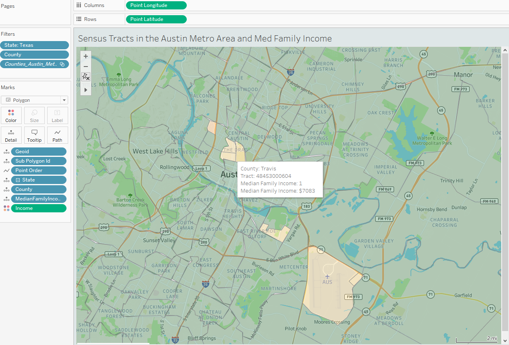

# CEA_DEEP_LEARNING - Food Deserts in the Austin, Texas Metro Area 
UTMCC DataViz Module 20 Project 

---

## Contents 
  * Overview
    - Purpose
    - Resources
  * Results
  * Summary
 

---  

## Overview 
  
  What is a Food Desert? - The USDA defines living in a food desert as living more than one mile from a supermarket in urban/suburban areas, and more than 10 miles from a supermarket in rural areas. These are areas of limited access to healthy, nutritious and affordable food. Food Deserts are also categorized by population density, the level of access to transportation, and income levels of the populations in these areas. The information that would be available by identifying Food Desert locations can help people mitigate access to healthy, lower cost food for their communities. 
   

   ### Purpose
   To apply machine learning and neural networks, and using the features within the provided dataset, create a binary classifier that is capable of predicting locations that are potentially Food Deserts.  
   
   
   The deliverables are:
   
   Segment I
   * Deliverable 1: Presentation
   * Deliverable 2: GitHub
   * Deliverable 3: Machine Learning Model
   * Deliverable 4: Database
    
  Segment II
   - Deliverable 1: Presentation
   - Deliverable 2: GitHub
   - Deliverable 3: Machine Learning Model
   - Deliverable 4: Database
   - Deliverable 5: Dashboard

  
   
  
   ### Resources
  * Data source: food_access_research_atlas.csv, food_access_variable_lookup.csv  sourced via kaggle https://www.kaggle.com/tcrammond/food-access-and-food-deserts from the USDA Economic Research Service, United States Department of Agriculture: https://www.ers.usda.gov/data-products/food-access-research-atlas/download-the-data/ 
  * Software: Windows10, Python 3.8.3, Pandas, GitHub, Jupyter Notebook, Colab Notebook, VS Code, Scikit-learn, TensorFlow, SQLAlchemy, SQLite, PostgreSQL, pgAdmin, Tableau 
  * Services: AWS S3 data storage, AWS RDS database hosting.
  
  
| Team Roles | Stephen | Olivia	| Kinuthia | Larry |
| :---: | :---: | :---: | :---: | :---: |
| Segment - I  | **Triangle** ML Model | **Square** GitHub Repo | **X** tech choices | **Circle** database |
| Segment - II | **Triangle** | **Square** | **X** | **Circle** |
| Segment - III |  |  |  |  |
| Segment - IV |  |  |  |  |

  
 

--- 

## Results

  ### For working code and python programs, please see: 

| **Segment - I** | **Segment - II** | **Segment - III** |
| :--- | :--- | :--- |
| `Food_Deserts_Module20.ipynb` | Data & db: `food_deserts_colab1.ipynb` Py Neural Net ML Model: `Food_Deserts_Segment2_NN_v1.ipynb` Py Supervised ML Model: `Food_Deserts_Segment2_SupervisedModels_v1.ipynb` PostgreSQL AWS RDS: `Module20_food_deserts.sql` |  |

Segment I:
   * For working code and python program, please see: `Food_Deserts_Module20.ipynb`

### Deliverables 1 - 4: [Presentation: Link for Google Slides](https://docs.google.com/presentation/d/1dVX5367_KH2e2Uqa4BGjRZkU12r1eEsXX5KotbnEDtQ/edit?usp=sharing)

   ### Deliverable 1: Presentation
   
   * Selected topic:  Food Deserts in the Austin, Texas Metro Area.
  
   * Reason why this topic was selected: Vertical farming and urban farming are becoming more prescient topics as climate change and increased urbanization of population occcurs.  Timely and accurate understanding of what locations can be considered "food deserts" can aid urban planning to preempt possible, or increasing, food scarcity in heavily urbanized locations.  This understanding can assist in increasing life-span, quality of life and resource allocation for future generations.
  
   * Description of the source data: The data was retrieved from Kaggle (https://www.kaggle.com/tcrammond/food-access-and-food-deserts).  The data comes from the United States Department of Agriculture on census-tract level data on access to supermarkets.
  
   * Questions hoping to answer with the data:
     
     - Segment I:
What geographic areas in the Austin, Texas metro area are defined as "Food Deserts"? 

      - Segment II:
Using Machine Learning, can levels of income be accurately predicted based upon a census tract being considered a food desert?

      
.
  
   
   ### Deliverable 2: GitHub  
   
   * READ.me established - complete 
   * Description of the communication protocols   
     - Slack (messaging)
     - Zoom (group meetings)
     - Git (working on your branch and creating pull requests) 
   * Individual Branches established, and each team member with min of:  
    
  Segment I : 4 commits

  Segment II: 8 commits 
   
   
   . 
   
   
   ### Deliverable 3: Machine Learning Model

  Segment I 
   * Present a provisional machine learning model that stands in for the final machine learning model and accomplishes the following:
      - Takes in data in from the provisional database

  Segment II

Preliminary data exploration: 
- The complete census tract contained close to 150 fields.  Excel was used to visually inspect and recognize that some fields could  be condensed or eliminated. Python was used to programmatically reduce the field list to 22 fields.  This allowed us to choose appropriate features for the Machine Learning.

Below is a condensed list of the variables within our data.
 - The X represents distance in miles. Where X = half, 1, 10, and 20 miles.
- From this condensed list, we chose #12 & #13 for the Machine Learning.**** 

   | **Feature** | **Description** |
   | :--- | :--- |
   | 1. 'lapopXshare' | Share of tract population that are beyond X mile from supermarket |
   | 2. 'lalowiXshare' | Share of tract population that are low income individuals beyond X mile from supermarket |
   | 3. 'lakidsXshare' | Share of tract population that are kids beyond X mile from supermarket |
   | 4. 'laseniorsXshare' | Share of tract population that are seniors beyond X mile from supermarket |
   | 5. 'lawhiteXshare' | Share of tract population that are white beyond X mile from supermarket |
   | 6. 'lablackXshare' | Share of tract population that are Black or African American beyond X mile from supermarket |
   | 7. 'laasianXshare' | Share of tract population that are Asian beyond X mile from supermarket |
   | 8. 'lanhopiXshare' | Share of tract population that are Native Hawaiian or Other Pacific Islander beyond X mile from supermarket |
   | 9. 'laaianXshare' | Share of tract population that are American Indian or Alaska Native beyond X mile from supermarket |
   | 10. 'laomultirXshare' | Share of tract population that are Other/Multiple race beyond X mile from supermarket |
   | 11. 'lahispXshare' | Share of tract population that are of Hispanic or Latino ethnicity beyond X mile from supermarket |
   | 12. 'lahunvXshare' | Share of tract housing units that are without vehicle and beyond X mile from supermarket |
   | 13. 'lasnapXshare' | Share of tract housing units receiving SNAP benefits count beyond X mile from supermarket |

Preliminary data preprocessing:
- Reduced dataframe from all of U.S. to 5 counties
- Created “Income” column which is based upon “Median Household Income”: <15000 (Impoverished), >15000 (Not Impoverished)

Preliminary feature engineering, preliminary feature
selection, and decision making process: 
(!Stephen, if needed, make edits for this section)

- Feature engineering: Created an impoverished column
- Feature Selection: Distance to supermarkets for housing units without vehicle and housing units receiving SNAP benefits
- Race and age do not qualify as a predictor for impoverishment. 
- Decision made: As a group, we decided “no, vehicle and snap benefits would be a better indicator for the Machine Learning.”
 

How data was split: "Larry"

- into training and testing sets: training splitting/stratify 

Description of the model and its limitations and benefits:

Three models will be used: Neural Network and two Supervised models (Easy Ensemble AdaBoost Classifer and Balanced Random Forest)

**Neural Network (NN)** 
Due to the size of this dataset (more than 72,000 datapoints), a NN was included due to the robustness and power of NNs. Unfortunately, NNs are code intensive requiring proper set-up compared to other machine learning models.

**Supervised Machines**
More easily set-up, outputs and analysis are more simple due to confusion matrices and F1 score.  The ease of analysis and set-up allows for multiple supervised machines to be produced on the same data, allowing for more robust analysis.
Limitations - large dataset, classifing big data can be a challenge. Imbalanced samples (not enough samples of each classifier) can easily throw off predictions.  
 

##### Outputs labels for input data Segment I & II

Seg I Target/Output variable = 

  | **Target/Output** | **Description** |
  | :--- | :--- |
  | **`LILATracts_1And10`** | Low income and low access tract measured at 1 mile for urban areas and 10 miles for rural areas |

Seg II Target/Output variable =

  | **Target/Output** | **Description** |
  | :--- | :--- |
  | **`Income`** | A binary variable created from the "Median Family Income" column.  Categories are "Impoverished" if income is below $15,000 and "Not Impoverished" if income is above $15,000 |      	

**Feature variables** 

Segment I:

   | **Feature** | **Description** |
   | :--- | :--- |
   | 1. `lasnaphalf` | Housing units receiving SNAP benefits count beyond 1/2 mile from supermarket |
   | 2. `lasnaphalfshare`  | Share of tract population that are beyond 1/2 mile from supermarket |
   | 3. `lahunvhalf` | Housing units without vehicle count beyond 1/2 mile from supermarket |
   | 4. `lahunvhalfshare` | Share of tract housing units that are without vehicle and beyond 1/2 mile from supermarket | 
   | 5. `lasnap1` | Housing units receiving SNAP benefits count beyond 1 mile from supermarket |
   | 6. `lasnap1share` | Share of tract housing units receiving SNAP benefits count beyond 1 mile from supermarket |
   | 7. `lahunv1` | Housing units without vehicle count beyond 1 mile from supermarket |
   | 8. `lahunv1share` | Share of tract housing units that are without vehicle and beyond 1 mile from supermarket | 
   | 9. `lasnap10` | Housing units receiving SNAP benefits count beyond 10 miles from supermarket |
   | 10. `lasnap10share` | Share of tract housing units receiving SNAP benefits count beyond 10 miles from supermarket |
   | 11. `lahunv10` | Housing units without vehicle count beyond 10 miles from supermarket |
   | 12. `lahunv10share` | Share of tract housing units that are without vehicle and beyond 10 miles from supermarket | 
   | 13. `lasnap20` | Housing units receiving SNAP benefits count beyond 20 miles from supermarket |
   | 14. `lasnap20share` | Share of tract housing units receiving SNAP benefits count beyond 20 miles from supermarket |
   | 15. `lahunv20` | Housing units without vehicle count beyond 20 miles from supermarket |
   | 16. `lahunv20share` | Share of tract housing units that are without vehicle and beyond 20 miles from supermarket |

**Feature variables** 

Segment II:
   | **Feature** | **Description** |
   | :--- | :--- |
   | 1. `lasnaphalfshare`  | Share of tract population that are beyond 1/2 mile from supermarket |
   | 2. `lahunvhalfshare` | Share of tract housing units that are without vehicle and beyond 1/2 mile from supermarket | 
   | 3. `lasnap1share` | Share of tract housing units receiving SNAP benefits count beyond 1 mile from supermarket |
   | 4. `lahunv1share` | Share of tract housing units that are without vehicle and beyond 1 mile from supermarket | 
   | 5. `lasnap10share` | Share of tract housing units receiving SNAP benefits count beyond 10 miles from supermarket |
   | 6. `lahunv10share` | Share of tract housing units that are without vehicle and beyond 10 miles from supermarket | 
   | 7. `lasnap20share` | Share of tract housing units receiving SNAP benefits count beyond 20 miles from supermarket |
   | 8. `lahunv20share` | Share of tract housing units that are without vehicle and beyond 20 miles from supermarket |

.
     
   ### Deliverable 4: Database
   
  #### Segment - I Requirements: (Complete)
  * Present a provisional database that stands in for the final database and accomplishes the following:
  * Sample data that mimics the expected final database structure or schema 
  * Draft machine learning module is connected to the provisional database  

  #### Segment - II database Requirements: (Complete)
  * stores static data
  * interfaces with the project
  * includes minimum of two tables
  * includes minimum of one JOIN with db language
  * includes minimum of one connection string 
  * provide the ERD with relationships

      
     | **Project Segment** | **database Status** |
     | :--- | :--- |
     | Seg - I | moving pandas dataframe data into SQLite db table   SQLite db table data to pd dataframe for ML model   Machine Learning model dataframe source   |
     | Seg - II | Using AWS RDS, and pgAdmin as the UI. Eight Tables are established.   The project interface and connection strings use Python in Colaboratory, running as a Spark Session.   Two JOIN unions are made, a LEFT JOIN within pgAdmin, and an INNER JOIN using PySpark code in colab.   The ERD, showing relationships.  |
     | Seg - III |  |
   

---

### Deliverable 5: Dashboard
#### Segment - II Requirements:

Dashboard tools: 
- AWS
- Tableau
- Jupyter Notebook
- Visual Studio Code

Dashboard Storyboard:

- Display the Austin metro area by county: Bastrop, Caldwell, Hays, Travis,  Williamson
- Within each county identify areas that are food deserts
- Display housing units without vehicle beyond 1/2,  1, 10, and 20 mile from supermarket
- Display housing units receiving SNAP benefits beyond 1/2,  1, 10, and 20 mile from a supermarket
- Display household income below 15,000 dollars		
- Use a bar chart to show percentage of population with a household income below 15,000 for each county and the portion of those that are  in a food desert

Dashboard Interactive Elements:

- Interactive legend that highlights  food deserts within the five counties of the Austin Metro Area
- Interactive legend that selects  1/2,  1, 10, and 20 miles for the distance between a supermarket and housing units receiving SNAP benefits  
- Interactive legend that selects  1/2,  1, 10, and 20 miles for the distance between a supermarket and housing units without vehicle  
- Hover functions that display
  - County name
  - Food desert: 0, 1
  - Family Income below: 15,000
- Display value of bars, in bar chart
- Categorize visualizations by low, median, and high income levels

Example of hover function shown below:

