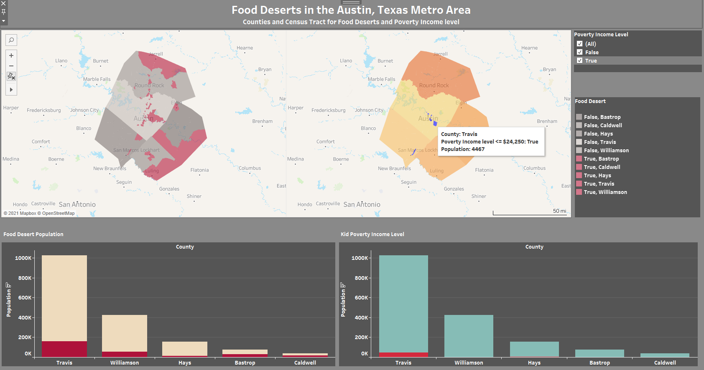
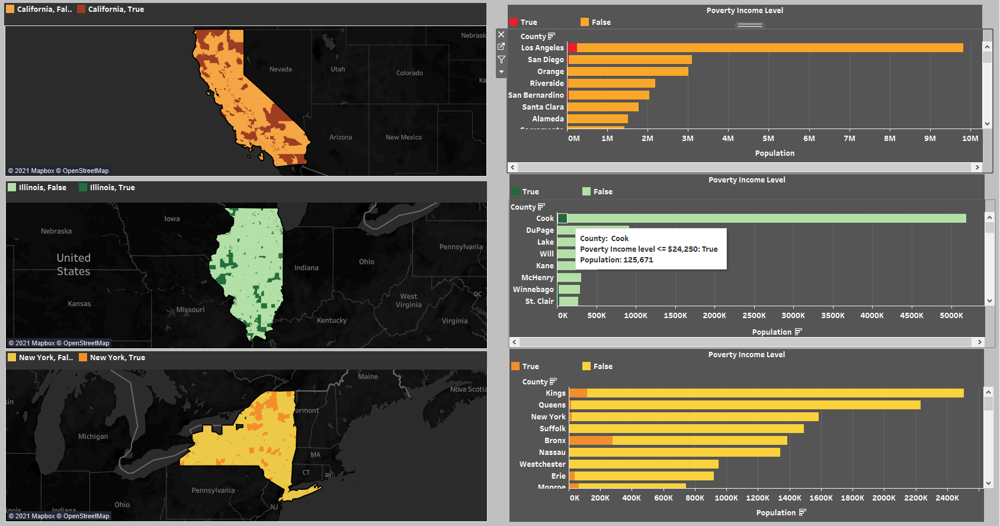
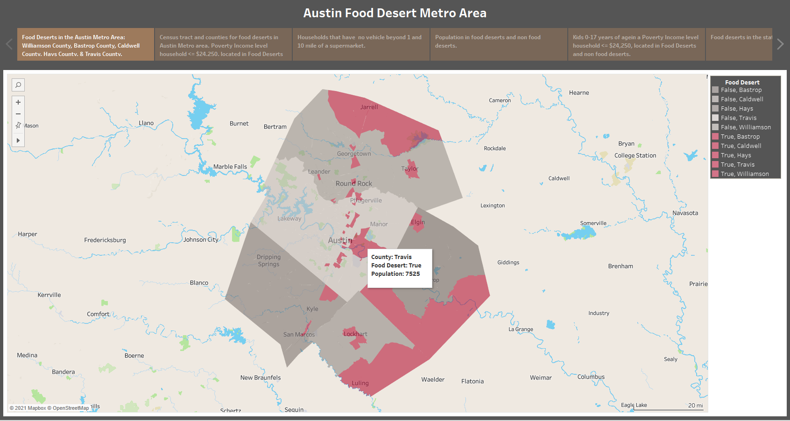
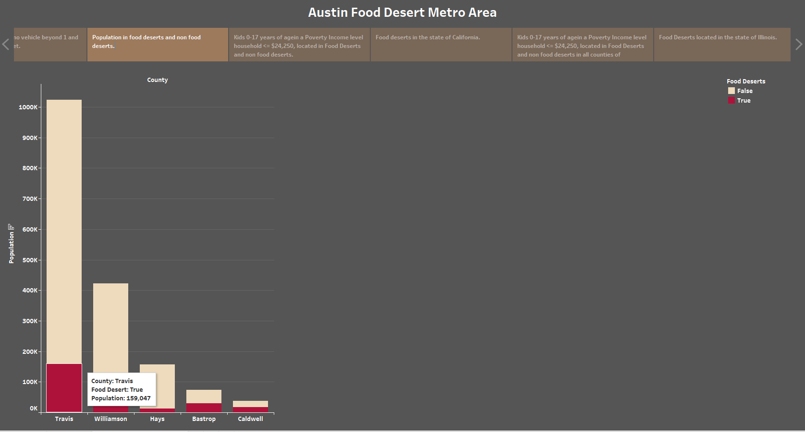

# CEA_DEEP_LEARNING - Food Deserts in the Austin, Texas Metro Area 
UTMCC DataViz Module 20 Team Project

---

## Contents 
  * Overview
    - Purpose
    - Resources
  * Results
  * Summary
 

---  

## Overview 
  
  What is a Food Desert? - The USDA defines living in a food desert as living more than one mile from a supermarket in urban/suburban areas, and more than 10 miles from a supermarket in rural areas. These are areas of limited access to healthy, nutritious and affordable food. Food Deserts are also categorized by population density, the level of access to transportation, and income levels of the populations in these areas. The information that would be available by identifying Food Desert locations can help people mitigate access to healthy, lower cost food for their communities. 
   

   ### Purpose
   To apply machine learning and deep learning neural networks, and using the features within the provided dataset, create a binary classifier that is capable of predicting locations that are potentially food deserts, and to determine a correlation between an identified food desert location with the median income level of the population.  
   
   
  #### Deliverables:
   
   Segment I
   * Deliverable 1: Presentation
   * Deliverable 2: GitHub
   * Deliverable 3: Machine Learning Model
   * Deliverable 4: Database
    
  Segments II, III and IV
   - Deliverable 1: Presentation
   - Deliverable 2: GitHub
   - Deliverable 3: Machine Learning Model
   - Deliverable 4: Database
   - Deliverable 5: Dashboard
   
  
  ### Resources
  * Data source: food_access_research_atlas.csv, food_access_variable_lookup.csv  sourced via kaggle https://www.kaggle.com/tcrammond/food-access-and-food-deserts from the USDA Economic Research Service, United States Department of Agriculture: https://www.ers.usda.gov/data-products/food-access-research-atlas/download-the-data/ 
  * Software: Windows10, Python 3.8.3, Pandas, GitHub, Jupyter Notebook, Colab Notebook, VS Code, Scikit-learn, TensorFlow, Boto3, SQLAlchemy, SQLite, PostgreSQL, pgAdmin, Tableau 
  * Services: AWS S3 data storage, AWS RDS database hosting.
  
  
| Team Roles | Stephen | Olivia	| Kinuthia | Larry |
| :---: | :---: | :---: | :---: | :---: |
| Segment - I  | **Triangle** ML Model | **Square** GitHub Repo | **X** tech choices | **Circle** database |
| Segment - II | **Triangle** | **Square** | **X** | **Circle** |
| Segment - III |**Triangle** | **Square** | **X** | **Circle**|
| Segment - IV | **Triangle** | **Square** | **X** | **Circle**| 

  
 

--- 

## Results

  ### For working code and python programs, please see: 

| **Segment - I** | **Segment - II** | **Segment - III** |
| :--- | :--- | :--- |
| `Food_Deserts_Module20.ipynb` | Data & db: `food_deserts_colab1.ipynb` Py Neural Net ML Model: `Food_Deserts_Segment2_NN_v1.ipynb` Py Supervised ML Model: `Food_Deserts_Segment2_SupervisedModels_v1.ipynb` PostgreSQL AWS RDS: `Module20_food_deserts.sql` | Data, database and Py Neural Net ML Model: `Food_Deserts_NN_Segment3_v1.ipynb` Py Supervised ML Model: `Food_Deserts_Segment2_SupervisedModels_v1.ipynb` AWS S3 bucket: `dataviz20-bucket`  PostgreSQL AWS RDS: `Module20_food_deserts.sql` Data Prep for Tableau Vizualizations: `tableau_data_explore_OR.ipynb` |

| **Segment - IV** |
| :--- |
| Data preprocessing, database connection,  and Python Neural Net ML Model: `Food_Deserts_NN_Segment4_Final.ipynb` Python Supervised ML Model: `Food_Deserts_Segment2_SupervisedModels_v1.ipynb` AWS S3 bucket: `dataviz20-bucket`  PostgreSQL AWS RDS: `Module20_food_deserts.sql` Data Preprocessing for Tableau Visualizations: `tableau_data_explore_OR.ipynb` | 

- - - 

### **[Dashboard: Link for Public Tableau](https://public.tableau.com/views/Food_Deserts_Austin_Metro_Area/Food_Deserts_Austin_Metro_Area?:language=en&:display_count=y&:origin=viz_share_link)**

. 

### **[Presentation: Link for Google Slides](https://docs.google.com/presentation/d/1dVX5367_KH2e2Uqa4BGjRZkU12r1eEsXX5KotbnEDtQ/edit?usp=sharing)**

- - - 

### Deliverables 1 - 4: 

  ### Deliverable 1: Presentation
   
   * Selected topic:  Food Deserts in the Austin, Texas Metro Area.
  
   * Reason why this topic was selected: Vertical farming and urban farming are becoming more prescient topics as climate change and increased urbanization of population occcurs. Timely and accurate understanding of what locations can be considered "food deserts" can aid urban planning to preempt possible, or increasing, food scarcity in heavily urbanized locations.  This understanding can assist in increasing life-span, quality of life and resource allocation for future generations.
  
   * Description of the source data: The data was retrieved from Kaggle (https://www.kaggle.com/tcrammond/food-access-and-food-deserts).  The data comes from the United States Department of Agriculture on census-tract level data on access to supermarkets.
  
   * Questions hoping to answer with the data:
     
     - Segment - I:
What geographic areas in the Austin, Texas metro area are defined as "Food Deserts"? 

      - Segment - II:
Using Machine Learning, can levels of income be accurately predicted based upon a census tract being considered a food desert?

      - Segment - IV:  Identify any questions for continuation of the project, and recommendations for future analysis.

.

  ### Deliverable 2: GitHub  
   
   * READ.me established  
    
   * Individual Branches established, and each team member with min of:  
    
  Segment - I : 4 commits each 

  Segment - II: 8 total commits each

  Segment - III: 12 total commits each

  Segment - IV: 16 total commits each

   . 

  ## Deliverable 3: Machine Learning Model

  **Segment - I** 
   * Present a provisional machine learning model that stands in for the final machine learning model and accomplishes the following:
      - Takes in data in from the provisional database

  **Segments - II and III**

**Preliminary data exploration:** 
- The complete census tract contained close to 150 fields.  Excel was used to visually inspect and recognize that some fields could  be condensed or eliminated. Python was used to programmatically reduce the field list to 22 fields.  This allowed us to choose appropriate features for the Machine Learning.

Below is a condensed list of the variables within our data.
 - The X represents distance in miles. Where X = half, 1, 10, and 20 miles.
- From this condensed list, we chose #12 & #13 for the Machine Learning.**** 

   | **Feature** | **Description** |
   | :--- | :--- |
   | 1. `lapopXshare` | Share of tract population that are beyond X mile from supermarket |
   | 2. `lalowiXshare` | Share of tract population that are low income individuals beyond X mile from supermarket |
   | 3. `lakidsXshare` | Share of tract population that are kids beyond X mile from supermarket |
   | 4. `laseniorsXshare` | Share of tract population that are seniors beyond X mile from supermarket |
   | 5. `lawhiteXshare` | Share of tract population that are white beyond X mile from supermarket |
   | 6. `lablackXshare` | Share of tract population that are Black or African American beyond X mile from supermarket |
   | 7. `laasianXshare` | Share of tract population that are Asian beyond X mile from supermarket |
   | 8. `lanhopiXshare` | Share of tract population that are Native Hawaiian or Other Pacific Islander beyond X mile from supermarket |
   | 9. `laaianXshare` | Share of tract population that are American Indian or Alaska Native beyond X mile from supermarket |
   | 10. `laomultirXshare` | Share of tract population that are Other/Multiple race beyond X mile from supermarket |
   | 11. `lahispXshare` | Share of tract population that are of Hispanic or Latino ethnicity beyond X mile from supermarket |
   | 12. `lahunvXshare` | Share of tract housing units that are without vehicle and beyond X mile from supermarket |
   | 13. `lasnapXshare` | Share of tract housing units receiving SNAP benefits count beyond X mile from supermarket |

**Preliminary data preprocessing:**
- Data set was checked for missing, null values with `isnull()`. No missing values were found.
- Reduced dataframe from all of U.S. to five counties for the Austin Texas Metro Area 
- Created “Income” column which is based upon “Median Household Income”, to be used as the target output for the machine learning models, y. The Income thresholds are: <= $24,250 (Impoverished), and > $24,250 (Not Impoverished). The Income threshold chosen is based on government guidance from 2015 for the Poverty Income Level for a family of four.

**Preliminary feature engineering, preliminary feature
selection, and decision making process:** 

- Feature engineering: Created an impoverished column
- Feature Selection: Distance to supermarkets for housing units without vehicle and housing units receiving SNAP benefits
- Race and age do not qualify as a predictor for impoverishment. 
- Decision made: As a group, we decided “no, vehicle and snap benefits would be a better indicator for the Machine Learning.”
 

**Description of how data was split for Training and Testing Sets:** 

- After the original dataset csv file was imported as the file `food_atlas_df`, it was preprocessed in two paths. One set with the purpose to use for Training the Neural Network Model, and one set of data as the subset for the Austin Metro Area that was used for Testing. 
- The dataframe used for Training was the `food_desertUS_df` set, and incorporates all original 72,864 rows of U.S. Census Tract data, preprocessed with model's X-Features with the generated y-Target as the Output for "Income". 
- A new dataframe was generated to be the Test data, `food_desert_Austin_df`, and included data only for the Census Tracts within the five Counties for the Austin Metro Area. In comparison, this data consists of 350 rows of data, with similar preprocessing for the same X-Features and y-Target for "Income".
- To convey the Neural Net Model's Callbacks with Checkpoints and Weights, the Hierarchical Data Format HDF5 as used for saving the weights, and then to load the model for use in the Test of the Austin Metro only data. 

**Description of the model choice and its limitations and benefits:**

Three models were used: Neural Network and two Supervised models (Easy Ensemble AdaBoost Classifer and Balanced Random Forest)

**Neural Network (NN)** 
Due to the size of this dataset (more than 72,000 datapoints), a NN was included due to the robustness and power of NNs. Unfortunately, NNs are code intensive requiring proper set-up compared to other machine learning models.

**Supervised Machines**
More easily set-up, outputs and analysis are more simple due to confusion matrices and F1 score.  The ease of analysis and set-up allows for multiple supervised machines to be produced on the same data, allowing for more robust analysis.
Limitations - large dataset, classifing big data can be a challenge. Imbalanced samples (not enough samples of each classifier) can easily throw off predictions.  
 

#### Outputs labels for input data Segments I & II

Segment - I Target/Output variable = 

  | **Target/Output** | **Description** |
  | :--- | :--- |
  | **`LILATracts_1And10`** | Low income and low access tract measured at 1 mile for urban areas and 10 miles for rural areas |

Segment - II Target/Output variable =

  | **Target/Output** | **Description** |
  | :--- | :--- |
  | **`Income`** | A binary variable created from the "Median Family Income" column.  Categories are "Impoverished" if income is below $15,000 and "Not Impoverished" if income is above $15,000.  | 

Segments - III and IV Target/Output variable =

  | **Target/Output** | **Description** |
  | :--- | :--- |
  | **`Income`** | A binary variable created from the "Median Family Income" column.  Categories are "Impoverished" if income is below or equal to $24,250 and "Not Impoverished" if income is above $24,250.  The target variable was already numeric int32, not categorical, however, a OneHotEncoder instance was created for the target to ensure that the values are encoded for use within the ML model. Post encoding, the Income value dtype was  float64. | 

.

**Feature variables**

Segment - I:

   | **Feature** | **Description** |
   | :--- | :--- |
   | 1. `lasnaphalf` | Housing units receiving SNAP benefits count beyond 1/2 mile from supermarket |
   | 2. `lasnaphalfshare`  | Share of tract population that are beyond 1/2 mile from supermarket |
   | 3. `lahunvhalf` | Housing units without vehicle count beyond 1/2 mile from supermarket |
   | 4. `lahunvhalfshare` | Share of tract housing units that are without vehicle and beyond 1/2 mile from supermarket | 
   | 5. `lasnap1` | Housing units receiving SNAP benefits count beyond 1 mile from supermarket |
   | 6. `lasnap1share` | Share of tract housing units receiving SNAP benefits count beyond 1 mile from supermarket |
   | 7. `lahunv1` | Housing units without vehicle count beyond 1 mile from supermarket |
   | 8. `lahunv1share` | Share of tract housing units that are without vehicle and beyond 1 mile from supermarket | 
   | 9. `lasnap10` | Housing units receiving SNAP benefits count beyond 10 miles from supermarket |
   | 10. `lasnap10share` | Share of tract housing units receiving SNAP benefits count beyond 10 miles from supermarket |
   | 11. `lahunv10` | Housing units without vehicle count beyond 10 miles from supermarket |
   | 12. `lahunv10share` | Share of tract housing units that are without vehicle and beyond 10 miles from supermarket | 
   | 13. `lasnap20` | Housing units receiving SNAP benefits count beyond 20 miles from supermarket |
   | 14. `lasnap20share` | Share of tract housing units receiving SNAP benefits count beyond 20 miles from supermarket |
   | 15. `lahunv20` | Housing units without vehicle count beyond 20 miles from supermarket |
   | 16. `lahunv20share` | Share of tract housing units that are without vehicle and beyond 20 miles from supermarket |

**Feature variables** 

**for Segments - II, III and IV**

   | **Feature** | **Description** |
   | :--- | :--- |
   | 1. `lasnaphalfshare`  | Share of tract population that are beyond 1/2 mile from supermarket |
   | 2. `lahunvhalfshare` | Share of tract housing units that are without vehicle and beyond 1/2 mile from supermarket | 
   | 3. `lasnap1share` | Share of tract housing units receiving SNAP benefits count beyond 1 mile from supermarket |
   | 4. `lahunv1share` | Share of tract housing units that are without vehicle and beyond 1 mile from supermarket | 
   | 5. `lasnap10share` | Share of tract housing units receiving SNAP benefits count beyond 10 miles from supermarket |
   | 6. `lahunv10share` | Share of tract housing units that are without vehicle and beyond 10 miles from supermarket | 
   | 7. `lasnap20share` | Share of tract housing units receiving SNAP benefits count beyond 20 miles from supermarket |
   | 8. `lahunv20share` | Share of tract housing units that are without vehicle and beyond 20 miles from supermarket |

  | **Project Segment** | **Machine Learning Model Summary and Accuracy** |
  | :--- | :--- |
  | **Segment - I** (provisional) |     |
  | **Segment - II** |     . |
  | **Segment - III** | **ML Training on full U.S. Census dataset**     .**ML Testing on the Austin-Metro only data**        |

.

**Description and explanation of the model’s final Accuracy score, and the confusion matrix:** (Please see the images below.)

**Accuracy**
- Training Accuracy, using full U.S. Census Tract data: 96.30%, with Loss of 0.112
- Testing Accuracy, on Test group of Austin-Metro-Area data: 94.32%, with Loss of 0.158 
- The accuracy score from the training set is relatively high, and with low loss. The model's weights are used with the test data model, and with a very similar value for accuracy as a result.

**Confusion Matrix**
*Analysis*
 
| **Segment - IV** | **NN Deep Learning Model** |
| :--- | :--- |
| **Training** | **Full U.S. Census dataset** Accuracy:  Confusion Matrix:  |
The model's overall accuracy is 96%.  This is also reflected in the Confusion Matrix.  Of the 18,216 data points in the training partition (roughly 25% of the total), 17,497 were "true negatives."  This means that the training model predicted 17497 points would be "Above Poverty Level" and those were true predictions.  While 719 were predicted to be "Above Poverty Level" and they were falsely labeled with those 719 actually being "Below Poverty Level."  This is a Type-1 (False Positive) Error.

| **Testing** | **Austin-Metro only data**  Accuracy:   Confusion Matrix:     |
Similar to the training model, the model's overall accuracy is 94%.  This is also reflected in the Confusion Matrix.  Of the 88 data points in the testing partition (roughly 25% of the total), 85 were "true negatives."  This means that the training model predicted 85 points would be "Above Poverty Level" and those were true predictions.  While 3 were predicted to be "Above Poverty Level" and they were falsely labeled with those 719 actually being "Below Poverty Level."  Again, this is a Type-1 (False Positive) Error.

 

## Statistical Analysis 
### If statistical analysis is not included as part of the analysis, describe how it would be included in the next future phases of the project:

.

## Results of Analysis
# STEVE - Description to write - in the bullets below ...
### Describe how the ML NN model addresses the question the project is solving: 
* abc
* def
* hij
* Based upon current category definitions, model suffers from severe underfitting

.

## Recommendations for Future Analysis, 
  ### and Things the team may have done differently:

* Target and acquire a larger dataset
* Preprocess for more even-distributed data
* Apply the learning and Training to more urban areas, in addition to the * Austin-Metro area
* Apply the data to at-risk children for nutrition
* Perform and use descriptive statistics

 

.
     
  ## Deliverable 4: Database
   
  #### Segment - I Database Requirements: 
  * Present a provisional database that stands in for the final database and accomplishes the following:
  * Sample data that mimics the expected final database structure or schema 
  * Draft machine learning module is connected to the provisional database  

  ### Segment - II, III and IV Database Requirements:
  * stores static data
  * interfaces with the project
  * includes minimum of two tables
  * includes minimum of one JOIN with database language
  * includes minimum of one connection string 
  * provide the Entity Relationship Diagram, ERD with relationships.

      
     | **Project Segment** | **database Status** |
     | :--- | :--- |
     | **Segment - I** | moving pandas dataframe data into SQLite db table   SQLite db table data to pd dataframe for ML model   Machine Learning model dataframe source   |
     |  |  |
     | **Segments - II, III and IV** | **Using AWS RDS, and pgAdmin as the User Iinterface. Eight Tables are established.**  **The project interface and connection strings to PostgreSQL with SQLAlchemy in Python.**   **Three JOIN unions are made, a LEFT JOIN within pgAdmin, and 2 INNER JOINs.**   **The ERD, showing relationships.**  |
    

. 

#### Data Pipeline and Technologies Used

.

 

## Deliverable 5: Dashboard

**[Dashboard: Link for Public Tableau](https://public.tableau.com/views/Food_Deserts_Austin_Metro_Area/Food_Deserts_Austin_Metro_Area?:language=en&:display_count=y&:origin=viz_share_link)**

#### Segment - II Requirements:

Dashboard tools: 
- AWS
- Tableau
- Jupyter Notebook
- Visual Studio Code

Dashboard Storyboard:

Segment II:
- Display the Austin metro area by county: Bastrop, Caldwell, Hays, Travis,  Williamson
- Within each county identify areas that are food deserts
- Display housing units without vehicle beyond 1/2,  1, 10, and 20 mile from supermarket
- Display housing units receiving SNAP benefits beyond 1/2,  1, 10, and 20 mile from a supermarket
- Display household income below 15,000 dollars		
- Use a bar chart to show percentage of population with a household income below 15,000 for each county and the portion of those that are  in a food desert

Segment III additions/edits:
- Create a bar chart that displays population for the five counties in Austin that are in a food desert and non food deserts
- Display housing units without vehicle beyond 1 & 10 miles of a supermarket
- Use a bar chart to show percentage of population with a household income below 24,250 dollars for each county and the portion of those that are  in a food desert
- Display bar chart of population of kids 0-17 years of age, who are impoverished and are in a Food Deserts in the Metro Austin area (Williamson, Bastrop, Caldwell, Hays, and Travis Counties)
- Show food desert maps for the following states: California, Illinois, & New York
- Display bar chart of population of kids 0-17 years of age, who are impoverished and are in Food Deserts for the states of California, Illinois, & New York 

Dashboard Interactive Elements:

Segment II:
- Interactive legend that highlights  food deserts within the five counties of the Austin Metro Area
- Interactive legend that selects  1/2,  1, 10, and 20 miles for the distance between a supermarket and housing units receiving SNAP benefits  
- Interactive legend that selects  1/2,  1, 10, and 20 miles for the distance between a supermarket and housing units without vehicle  
- Hover functions that display
  - County name
  - Food desert: 0, 1
  - Family Income below: 15,000
- Display value of bars, in bar chart
- Categorize visualizations by low, median, and high income levels

Dashboard Interactive Elements:

Segment III:

- Hover functions for maps & charts
  - County name
  - Food desert: True or False
  - Poverty Income level <= $24,250 
  - No vehicle
  - Population count

Preprocess data for Tableau Dashboards & Storyboard:

  

Example of Dashboard 1:

  

Example of Dashboard 2:

  

Example of hover functions shown below:

  

  

  

